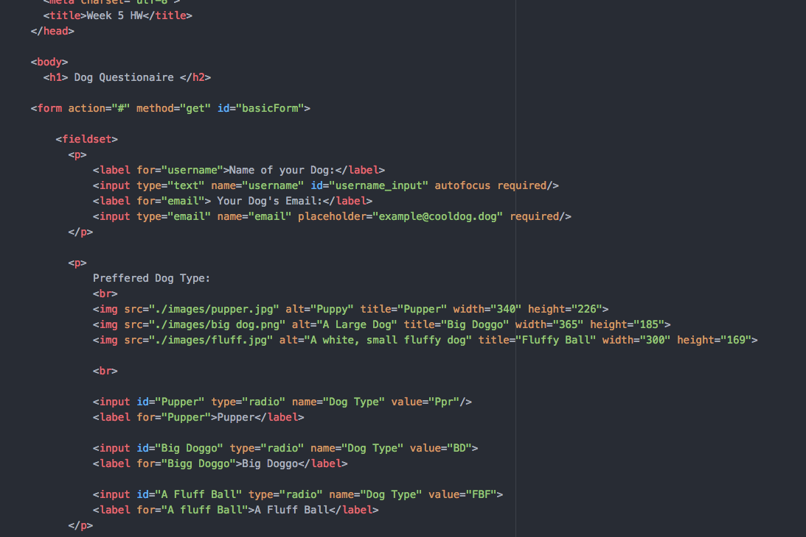

## Sierra Shaw, 50

# **Report**
1. I think I generally got assignment. It's pretty easy in itself, but it will only become easy for me through lots of repetition and practice. The subject of my website was something many people are interested in or can relate. Though don't take my wording in the webpage too seriously.
2. A problem I had specifically was the placement of the ""<form>....</form> and <fieldset>...</fieldset>"in relation to each of the forms. As well as the placement of the submit button. I was unsure if you placed it in each form or fieldset. So what I'm saying was my biggest issues was the overall formatting of the document.
3. Overall I don't think I did too terribly. I like the pace of this class, and I don't feel too rushed. I learned how to create an interactive "data mining" website.
4. 
5. Also I never have enough information to properly fill this to your standards, so I'm strugglin a bit here.
