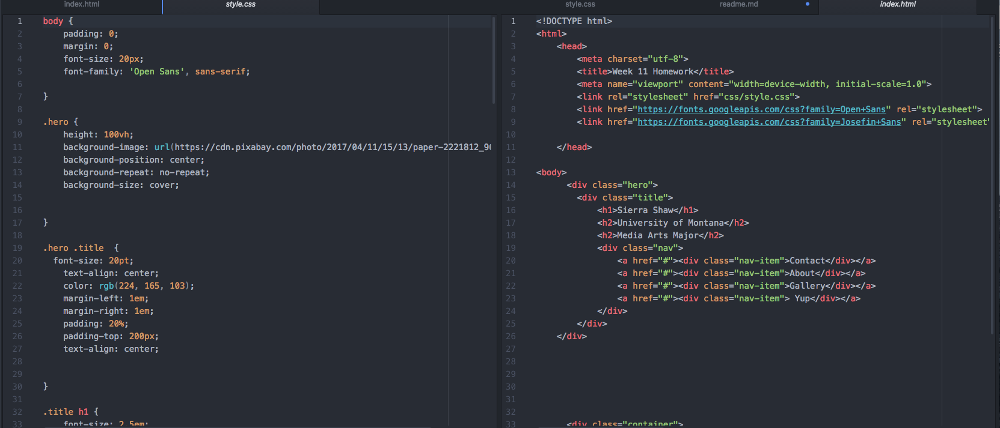

It was really cool seeing it all come together. I'm still not very confident in this but it's cool to make things that people could potentially use. I still have a lot questions and most of them I can remember.

One question I need answered, is I was having trouble adjusting the position of the text inside a hero image without affecting the image. It kept shifting the image as well as the text. Also things were not changing as they should as I resized the browser. Keep in mind that my Final project is in a very rough stage.

